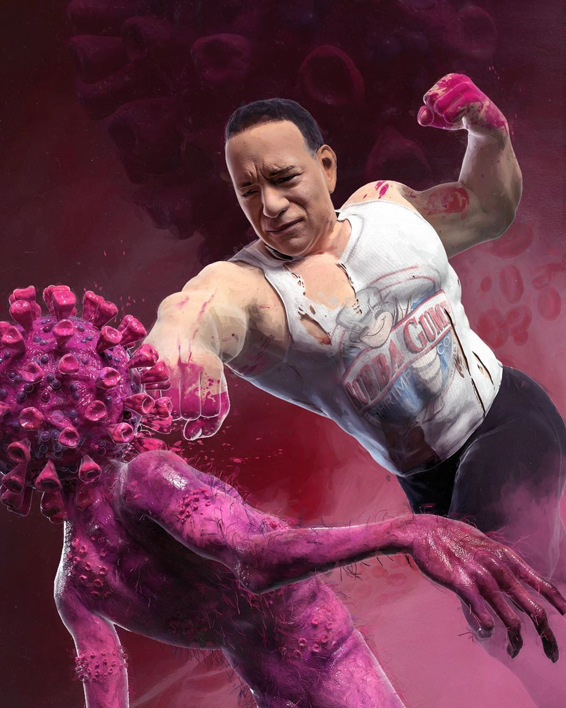
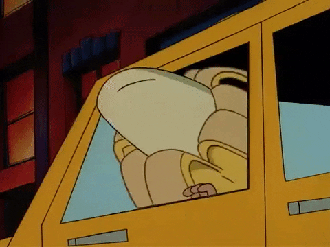

The following is a bunch of rambling to get a formatting baseline.

_Credit:_ [@beeple_crap](https://www.instagram.com/p/B9qJr-ygqfL/)

Here I am, dying slowly of [COVID 19](https://www.google.com/search?client=firefox-b-1-d&sxsrf=ALeKk02siRXkMdtYZpdwAUZYsPjy1t6F5Q%3A1584495405295&ei=LXtxXpfUEdOU-gSO2KHwDQ&q=covid+19+2020&oq=covid+19+2020&gs_l=psy-ab.3..0i324l3j0i8i30.3445.7121..7305...1.0..0.298.1713.2j2j5......0....1..gws-wiz.......35i39j0i131i10j0i10.h1oKC_qTeDY&ved=0ahUKEwjXnp-u8aLoAhVTip4KHQ5sCN4Q4dUDCAo&uact=5) - _kidding... hopefully..._ - looking for something to keep my mind off of the feeling off of my shredded, vibrating, generally unhappy lungs while abiding **"The Order"**:

<blockquote class="twitter-tweet">
Effective at midnight, San Francisco will require people to stay home except for essential needs.   Necessary government functions &amp; essential stores will remain open.  These steps are based on the advice of public health experts to slow the spread of <a href="https://twitter.com/hashtag/COVID19?src=hash&amp;ref_src=twsrc%5Etfw">#COVID19</a>.
&mdash; London Breed (@LondonBreed) <a href="https://twitter.com/LondonBreed/status/1239626809865416704?ref_src=twsrc%5Etfw">March 16, 2020</a></blockquote> 

So here's the first post, so I have something to work with. Look, I even added a twitter plugin that I may never use again! `#:point_up:` Oh shit! Did he also add the emoji plugin? You bet your `#:peach:` I did. `#:poop:`

Will I embed [videos](https://www.youtube.com/watch?v=X2kPLQEFR6Y) as well? No.

But pour one out for me and enjoy some stuff:

- [A social distancing meme](https://twitter.com/SwiftOnSecurity/status/1240067056646664193)
- [A popular COVID 19 article](https://medium.com/@tomaspueyo/coronavirus-act-today-or-people-will-die-f4d3d9cd99ca) written before SF went on lockdown.
- [SF lockdown restrictions](https://sf.gov/stay-home-except-essential-needs)
- [Doja Cat 1](https://open.spotify.com/track/3Dv1eDb0MEgF93GpLXlucZ?si=gh5OilTnStqeFwzB_XSLPA)
- [Doja Cat 2](https://www.youtube.com/watch?v=mXnJqYwebF8)

Peace.

